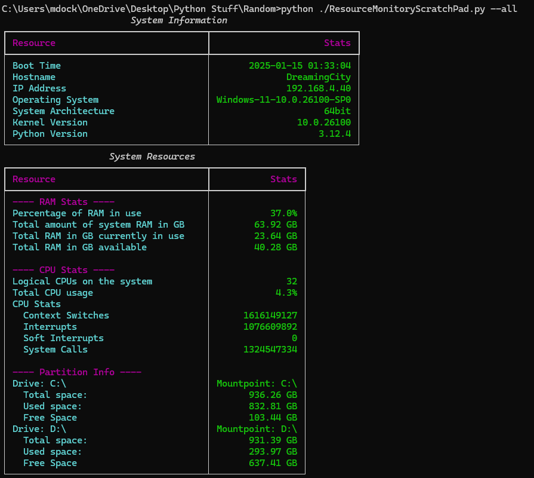

# System Info
 A command-line utility that displays system information and resource usage on Windows operating systems.

 

Features
- View **RAM usage**, including total, used, and available memory.
- Monitor **CPU usage**, including logical core counts, percentage usage, and system stats like context switches and interrupts.
- Display detailed **disk partition information**, including total, used, and free space.
- Retrieve system metadata such as hostname, boot time, OS version, and architecture.
- Combine all system information into a single, readable console output.

## Requirements
This script requires Python 3.6 or higher and the following libraries:
- `psutil`
- `rich`

To install the dependencies, run:
```bash
pip install psutil rich
